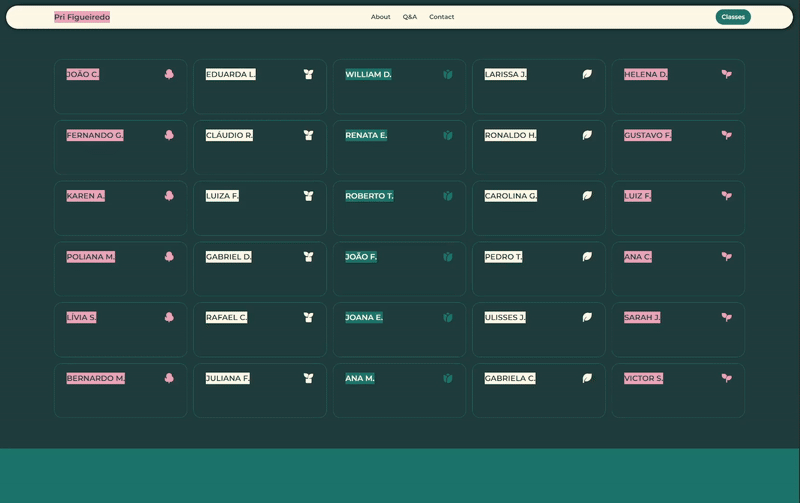

# English Tutoring

O site Pri Figueiredo | English Tutoring foi desenvolvido como estudo para a professora de inglês Pri Figueiredo, para que pudesse apresentar o seu trabalho e permitir acesso de seus alunos às suas páginas individuais. 

Como fui sua aluna, tivemos diversas discussões sobre como melhorar o site existente e buscamos referências e modelos do site ideal para a Pri, respeitando a estética que a agradava e unindo à funcionalidade desejada.

Os desejos principais da professora foram: um site que refletisse sua personalidade; utilização de background escuro; uso de cores e bordas arredondadas; navegação simples e intuitiva. 

  

### VueJS
Foi uma oportunidade de utilizar o ambiente Vite para testar o uso do VueJS, uma vez que é um projeto simples e que me permitiria explorar o framework de maneira rápida. 

Tive a oportunidade de ter o meu primeiro contato com um projeto dividido em views, components, composables e router, e entender a importância e facilidade de manutenção de código que o uso desta divisão promove.

<ul>
<li>Views: o site conta com duas páginas principais, sendo elas Home e Classes.</li>
</ul>

  

  Página 'Classes'

 
<ul>
<li>Components: Header, Footer e MobileMenu são os componentes comuns a todas as páginas.</li>
<li>Composables: o composable useMenu existe para controlar o estado do menu (se está aberto ou fechado) através do clique.</li>
</ul>

### Aprendizados
<ul>
<li>Senti que trabalhar com VueJS é similar a trabalhar com um projeto em JavaScript puro, já que o framework ainda tem como base uma separação clara entre template, script e style (diferente do ReactJS).</li>
<li>Percebi que o VueJS utiliza menos linhas de código para algumas funcionalidades, como para a criação de eventos + funções com parâmetros e para a manipulação condicional de elementos.</li>
<li>Entendi que é um framework para ser usado em projetos como esse, que buscam simplicidade e uma produtividade mais rápida, já que oferece uma estrutura completa sem muita configuração.</li>
</ul>

## Tecnologias:
  
          
## Preview:

